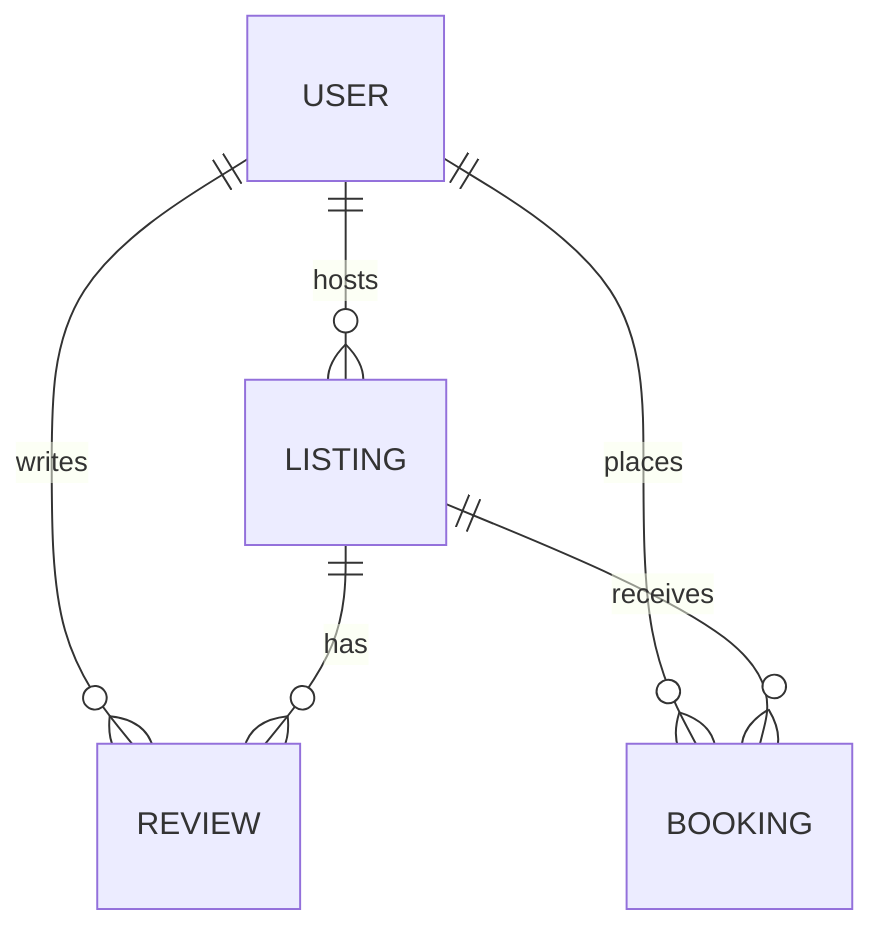
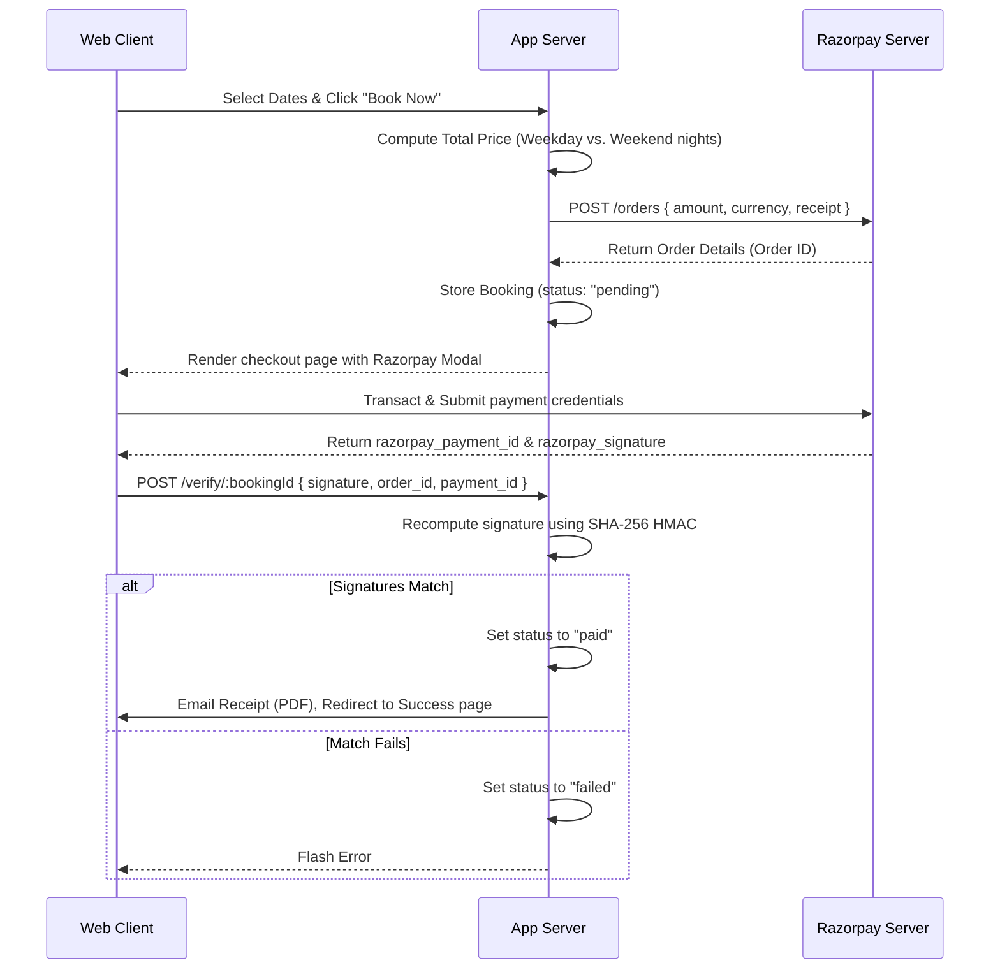

# HomeQuest - Technical Interview Revision Guide 🚀

This revision guide is designed to help you ace your project presentation and technical interviews for **HomeQuest**. It breaks down the technical architecture, core features, implementation mechanics, security concepts, and typical interview questions.

---

## 📅 The 5-Day Fast-Track Revision Plan

| Day | Focus Area | Code Files to Review | Target Goals |
| :--- | :--- | :--- | :--- |
| **Day 1** | **Architecture & DB Schema** | [app.js](file:///Users/saptarshiupadhyay/Desktop/HomeQuest/app.js), [models/](file:///Users/saptarshiupadhyay/Desktop/HomeQuest/models/) | Explain the MVC model flow & cascade triggers. |
| **Day 2** | **Auth, Security & Joi Validation** | [middleware.js](file:///Users/saptarshiupadhyay/Desktop/HomeQuest/middleware.js), [schema.js](file:///Users/saptarshiupadhyay/Desktop/HomeQuest/schema.js) | Explain session management and schema validation. |
| **Day 3** | **Payments (Razorpay)** | [controllers/booking.js](file:///Users/saptarshiupadhyay/Desktop/HomeQuest/controllers/booking.js), [views/bookings/](file:///Users/saptarshiupadhyay/Desktop/HomeQuest/views/bookings/) | Draw the sequence diagram & signature check logic. |
| **Day 4** | **PDF, Email & External APIs** | [controllers/booking.js](file:///Users/saptarshiupadhyay/Desktop/HomeQuest/controllers/booking.js) (PDF/Nodemailer), Mapbox scripts | Explain dynamic POI search & in-memory PDF generation. |
| **Day 5** | **Mock Interviews & Scaling** | Review Q&A Section | Practice the 60-second pitch & answer scaling questions. |

---

## ⚡ The 60-Second Elevator Pitch

> *"**HomeQuest** is a feature-rich, full-stack vacation rental web application inspired by Airbnb, designed to help users list, discover, and book unique stays around the world. Built on a clean Node.js/Express MVC architecture with a MongoDB database, the project implements key industrial features like **secure e-commerce payment validation via Razorpay**, **interactive POI map discovery utilizing the Mapbox Tilequery API**, **dynamic weekday/weekend pricing calculations**, **real-time weather forecasts via Open-Meteo**, and **automated PDF invoice generation streamed to email accounts using PDFKit and Nodemailer**. It is fully secure, supporting session-based authentication, Google OAuth 2.0, and strict Joi schema validations."*

---

## 🏗️ 1. Architecture & Database Design

### Model-View-Controller (MVC) Flow
1. **Model**: Database Schemas (`models/`) define structural documents using Mongoose ODM.
2. **View**: Frontend templates (`views/`) render static and dynamic content using Embedded JavaScript (EJS).
3. **Controller**: Business logic engines (`controllers/`) process client requests, interact with models, and render the appropriate views.

### Relational Schema Design
We map relationships in MongoDB (a NoSQL document database) using **Object IDs** (`Schema.Types.ObjectId`) and reference keys (`ref`):
* **Listing** references **User** (as `owner`) and an array of **Reviews** (as `reviews`).
* **Review** references **User** (as `author`).
* **Booking** references **Listing** (as `listing`) and **User** (as `user`).



### Cascade Deletes (Pre/Post Middleware)
In [models/listing.js](file:///Users/saptarshiupadhyay/Desktop/HomeQuest/models/listing.js), we set up a post-delete Mongoose hook to ensure orphaned reviews are deleted when a listing is removed:
```javascript
listingSchema.post("findOneAndDelete", async (listing) => {
    if (listing) {
        await Review.deleteMany({ _id: { $in: listing.reviews } });
    }   
});
```

---

## 🛡️ 2. Authentication, Authorization & Security

### Authentication (Local + Google OAuth)
* **Local Strategy**: Managed using Passport.js and `passport-local-mongoose`. This plugin simplifies salting and hashing credentials, storing the result in the database via the **PBKDF2 (Password-Based Key Derivation Function 2)** algorithm.
* **OAuth 2.0 Strategy**: Implemented using Passport's `GoogleStrategy`. This delegates credentials check securely to Google.
* **Persistent Sessions**: Sessions are initialized via `express-session` and saved persistently using **MongoStore** to avoid resetting user logins on server reboots.

### Authorization Gates & Guards
We define middleware guards in [middleware.js](file:///Users/saptarshiupadhyay/Desktop/HomeQuest/middleware.js) to restrict actions:
1. `isLoggedIn`: Verifies if `req.isAuthenticated()` is true; if not, stores the requested URL path in `req.session.redirectUrl` and redirects to login.
2. `isOwner`: Fetches the listing by ID and checks if `listing.owner.equals(req.user._id)`.
3. `isReviewAuthor`: Prevents unauthorized deletion of reviews.

### Server-Side Data Validation
To prevent invalid inputs (like negative prices or missing fields) from corrupting the database:
* We define validation structures using **Joi** schemas in [schema.js](file:///Users/saptarshiupadhyay/Desktop/HomeQuest/schema.js).
* We execute `validateListing` and `validateReview` middleware during creation and editing endpoints.

---

## 💳 3. Razorpay Payment & Signature Verification

To make checkout secure, the payment flow strictly isolates client execution and processes critical confirmations on the backend:



### Signature Verification Algorithm
Inside [controllers/booking.js](file:///Users/saptarshiupadhyay/Desktop/HomeQuest/controllers/booking.js), we calculate the cryptographic signature using the node `crypto` package:
```javascript
const expectedSignature = crypto
    .createHmac("sha256", process.env.RAZORPAY_KEY_SECRET)
    .update(razorpay_order_id + "|" + razorpay_payment_id)
    .digest("hex");

const isAuthentic = expectedSignature === razorpay_signature;
```
> **Why is this critical?** Without this verification step, a malicious user could spoof network requests or modify client-side scripts to send dummy success calls to the backend, booking accommodations without transferring money.

---

## 🗺️ 4. Interactive Maps & Mapbox Tilequery

1. **Geocoding**: During listing creation in [controllers/listing.js](file:///Users/saptarshiupadhyay/Desktop/HomeQuest/controllers/listing.js), the location string is converted to coordinate objects `[Longitude, Latitude]` using Mapbox Geocoding API:
   ```javascript
   const response = await geocodingClient.forwardGeocode({
       query: req.body.listing.location,
       limit: 1
   }).send();
   listing.geometry = response.body.features[0].geometry; // GeoJSON format
   ```
2. **Attraction Finder (Tilequery API)**: On the listing details page, we call Mapbox's Tilequery API from the client script ([public/js/map.js](file:///Users/saptarshiupadhyay/Desktop/HomeQuest/public/js/map.js)) using the listing coordinates to look up Points of Interest (POIs) in a **3km radius**:
   ```javascript
   const response = await fetch(`https://api.mapbox.com/v4/mapbox.mapbox-streets-v8/tilequery/${coords[0]},${coords[1]}.json?radius=3000&layers=poi_label&access_token=${token}&limit=10`);
   ```
3. **Interactive UI**: Clicking on the attraction sidebar list pans the map dynamically to the attraction coordinates and opens a coordinates link mapping to Google Maps.

---

## 📅 5. Dynamic Dates & Blocked Calendars

1. **Availability Validation**: When displaying a listing's detail page, we load all active paid bookings for the current listing, convert them to ISO format strings, and send them to the client.
2. **Flatpickr integration**: In EJS template pages, the calendar plugin is instantiated with:
   ```javascript
   flatpickr("#dateRangePicker", {
       mode: "range",
       minDate: "today",
       disable: bookedRanges // [ {from: '2026-07-30', to: '2026-08-02'} ]
   });
   ```
3. **Double Booking Prevention**: Even if a user bypasses the UI calendar block, the backend double checks dates on creation inside [controllers/booking.js](file:///Users/saptarshiupadhyay/Desktop/HomeQuest/controllers/booking.js) by querying MongoDB for overlapping date ranges:
   ```javascript
   const overlap = await Booking.findOne({
       listing: id,
       paymentStatus: "paid",
       $or: [
           { checkIn: { $lte: checkOutDate }, checkOut: { $gte: checkInDate } }
       ]
   });
   if (overlap) throw new Error("Dates already booked!");
   ```

---

## 💵 6. Weekend Premium Dynamic Pricing

To maximize host revenues, the engine dynamically modifies rates:
* **Rule**: Stays on Friday and Saturday nights utilize `weekendPrice`. Other nights utilize standard `price`.
* **Server-Side Calculator**:
  ```javascript
  let totalPrice = 0;
  let current = new Date(checkInDate);
  while (current < checkOutDate) {
      let day = current.getDay(); // 0 = Sun, 5 = Fri, 6 = Sat
      if (day === 5 || day === 6) {
          totalPrice += weekendPrice;
      } else {
          totalPrice += weekdayPrice;
      }
      current.setDate(current.getDate() + 1);
  }
  ```

---

## 🖨️ 7. PDFKit Buffer & Nodemailer Pipeline

To deliver receipts instantly without consuming disk storage or risking file cleanup cron jobs, the PDF is built entirely **in-memory** and emailed:
1. **PDFKit Generation**: An in-memory buffer is built using asynchronous data listeners:
   ```javascript
   const doc = new PDFDocument({ margin: 50 });
   let buffers = [];
   doc.on('data', buffers.push.bind(buffers));
   doc.on('end', () => resolve(Buffer.concat(buffers)));
   // Draws invoice contents (Tables, items, price headers)
   doc.end();
   ```
2. **Nodemailer SMTP Pipeline**: The generated binary buffer is attached directly, saving server write/read I/O cycles:
   ```javascript
   attachments: [{
       filename: `Receipt_${booking._id}.pdf`,
       content: pdfBuffer,
       contentType: 'application/pdf'
   }]
   ```

---

## 💬 Top Technical Interview Questions & Answers

### 🙋 Q1: Why did you choose session-based cookie authentication instead of JWT (JSON Web Tokens)?
> **Answer**: Session authentication is ideal for monolithic applications (MVC pattern) where the server and client reside in the same domain. Sessions support **stateful storage** on the backend, allowing us to easily revoke user access or force-log out users when profiles are compromised (by deleting sessions in the `MongoStore`). JWTs, by contrast, are stateless and harder to invalidate before expiry unless you build complex blacklisting schemes, making sessions safer for applications that do not require multi-domain API sharing.

### 🙋 Q2: How did you protect your database against SQL/NoSQL Injection?
> **Answer**: 
> 1. We use **Mongoose schemas**. Since parameters are explicitly cast to schema structures (e.g. `ObjectId` or `Number`), string queries like `$gt: ""` injected via POST fields are filtered or rejected.
> 2. We use Joi Schema validation to explicitly parse the shapes of request bodies before passing variables to DB queries.
> 3. Express urlencoded parsing is configured securely to avoid query-string pollution.

### 🙋 Q3: What is the benefit of generating the PDF invoice in-memory (using Buffers) rather than writing a file to disk first?
> **Answer**: Creating files on disk creates two major issues:
> * **Server I/O Bottlenecks**: Writing and reading files from disk is significantly slower than RAM operations.
> * **Disk Leaks & Maintenance**: Temporary files accumulate over time and fill up storage unless a background cron job runs to clean them up. By compiling the PDF to a RAM buffer and sending it directly to Nodemailer as an attachment stream, the file is automatically garbage collected from memory after delivery, optimizing resource usage.

### 🙋 Q4: How would you handle a race condition where two users attempt to book the exact same dates simultaneously?
> **Answer**: 
> 1. At the database level, we can implement **transactions** using MongoDB sessions to ensure checks and updates run atomically.
> 2. Alternatively, we can use a **unique compound index** or a lock key (e.g. Redis locks) matching `listingId` and `bookingDate`.
> 3. In our code, we verify dates overlap *twice*: first before requesting a Razorpay order, and second inside a transaction when the payment signature is confirmed, immediately rolling back if another booking marked the slot as "paid".

### 🙋 Q5: If this application scales to 100k daily active users, where will the bottleneck be, and how would you fix it?
> **Answer**: 
> * **The Bottleneck**: The primary bottleneck will be **database queries** (fetching listings, validating overlapping bookings on every view) and **session store operations** hitting MongoDB.
> * **The Solution**: 
>   1. **Caching**: Implement a **Redis** caching layer to cache listing details, POIs, and weather details.
>   2. **Database Optimization**: Add compound database indexes on `[listing, checkIn, checkOut]` to speed up overlapping booking queries.
>   3. **Stateless Scale**: Shift session storage from MongoDB to Redis, or transition to JWT-based authentication so Express nodes can run completely statelessly behind an NGINX load balancer.
