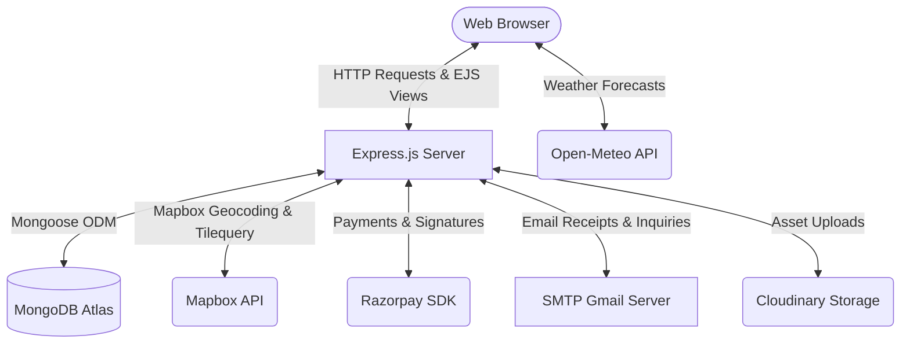
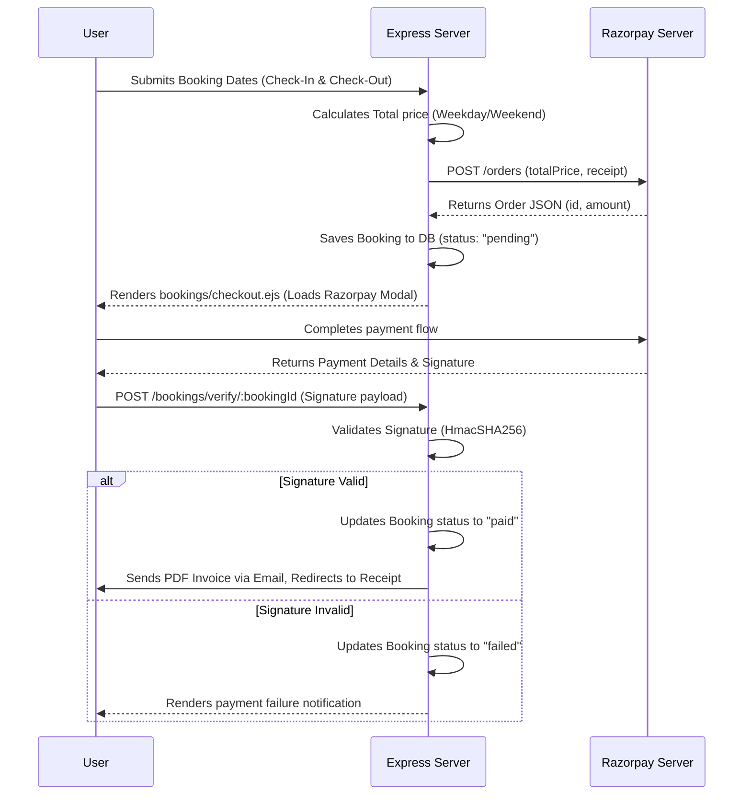

# HomeQuest - Project Documentation & Architecture Guide

Welcome to the comprehensive, top-to-bottom technical documentation for **HomeQuest** (a college major project). HomeQuest is a premium, feature-rich, full-stack vacation rental web application inspired by Airbnb. It is built using the Node.js/Express backend ecosystem, MongoDB/Mongoose databases, EJS templates on the frontend, and incorporates advanced APIs like Mapbox, Razorpay, Open-Meteo, Cloudinary, and Nodemailer.

---

## Table of Contents
1. [System Architecture & Core Technology Stack](#1-system-architecture--core-technology-stack)
2. [Project Directory Structure](#2-project-directory-structure)
3. [Database Schema Design & Models](#3-database-schema-design--models)
4. [Routing & Controller Architecture](#4-routing--controller-architecture)
5. [Key Feature Implementations](#5-key-feature-implementations)
   - [A. Authentication & Security (Local & Google OAuth)](#a-authentication--security-local--google-oauth)
   - [B. Interactive Map & Tilequery Attraction Finder](#b-interactive-map--tilequery-attraction-finder)
   - [C. Dynamic Date Picking & Booked Ranges Blocking](#c-dynamic-date-picking--booked-ranges-blocking)
   - [D. Weekday vs. Weekend Pricing Engine](#d-weekday-vs-weekend-pricing-engine)
   - [E. Razorpay Payment Gateway & Checkout Flow](#e-razorpay-payment-gateway--checkout-flow)
   - [F. Automated PDF Invoicing & Email Receipts](#f-automated-pdf-invoicing--email-receipts)
   - [G. Weather widget (Open-Meteo)](#g-weather-widget-open-meteo)
   - [H. Wishlists & User Profiles](#h-wishlists--user-profiles)
   - [I. Responsive Dark Mode Engine](#i-responsive-dark-mode-engine)
6. [Environment Configuration](#6-environment-configuration)
7. [Installation & Database Seeding](#7-installation--database-seeding)

---

## 1. System Architecture & Core Technology Stack

HomeQuest is built on a robust Model-View-Controller (MVC) server architecture:



- **Backend**: Node.js & Express.js (v5.1.0)
- **Database**: MongoDB & Mongoose ODM (v8.17.1) for structural schemas
- **Frontend / Templating**: Embedded JavaScript (EJS) using `ejs-mate` for layouts, styled with Bootstrap 5.3 + custom modern CSS (incorporating glassmorphism, responsive grid layouts, custom loading skeletons, and custom transitions).
- **Authentication**: Passport.js for session-based cookie authentication. Supports standard local password authentication and Google OAuth 2.0.
- **Third-Party Service Integrations**:
  - **Mapbox API**: For address-to-coordinate geocoding and rendering interactive maps with Tilequery POI search.
  - **Razorpay**: E-commerce payment gateway processing transactions.
  - **PDFKit**: For generating custom, structured, PDF invoices dynamically on the server.
  - **Nodemailer**: SMTP Gmail client configured to dispatch emails containing host inquiries and PDF attachments.
  - **Cloudinary**: Cloud image server hosting listing galleries and user avatars.
  - **Open-Meteo API**: Lightweight weather forecast client pulling current weather code summaries.

---

## 2. Project Directory Structure

Below is the directory structure layout for the HomeQuest application:

```text
HomeQuest/
├── app.js                      # Main application entry point (Middleware config, passport setup, routes hook)
├── cloudConfig.js              # Cloudinary Storage configuration for Multer uploads
├── middleware.js               # Route guards (Authentication, Ownership, Joi validation schema guards)
├── schema.js                   # Joi schemas validation definitions (Listing validation, Review validation)
├── vercel.json                 # Serverless deployment configuration for Vercel
├── controllers/                # MVC Controller Layer (Core business logic)
│   ├── booking.js              # Booking creation, payment verification, PDF & email triggers
│   ├── listing.js              # Listing CRUD, host dashboard, Mapbox forward geocoding, inquiry SMTP dispatcher
│   ├── review.js               # Review creation and deletion logic
│   └── users.js                # Profile updates, wishlists toggles, local signups, mock/live Google OAuth callbacks
├── models/                     # Mongoose Schema Definitions (Data layer models)
│   ├── booking.js              # Booking metadata schema (check-in/check-out dates, razorpay IDs, price, status)
│   ├── listing.js              # Listing model schema (coordinates, images array, title, price, weekendPrice)
│   ├── review.js               # Review model schema (comment, rating, author ref)
│   └── user.js                 # User profile schema (googleId, bio, wishlist, avatar, passport-local plugin)
├── init/                       # Database initialization and seeding scripts
│   ├── data.js                 # Initial seed array of listings
│   └── index.js                # Script to drop database, geocode seed locations, add amenities, and insert listings
├── routes/                     # Router Layer (API URLs structure map)
│   ├── booking.js              # Routes for creating and verifying individual booking sessions
│   ├── listing.js              # Routes for CRUD, dashboards, and inquiries
│   ├── myBookings.js           # Routes for checking users' booking list, receipts, and cancellations
│   ├── review.js               # Routes for review creation and deletion
│   └── user.js                 # Routes for login, signup, profiles, wishlist, and Google OAuth
├── public/                     # Static Client assets
│   ├── css/
│   │   ├── rating.css          # Starability star rating styling sheets
│   │   └── style.css           # Core styling overrides (theme definitions, buttons, glassmorphic layout)
│   ├── js/
│   │   ├── map.js              # Mapbox GL initialization, markers, popups, and resize handlers
│   │   └── script.js           # Theme toggle persistence, Bootstrap validator, wishlist AJAX, toast dismissal
│   ├── favicon.svg             # Application logo favicon
│   ├── robots.txt              # Search engine rules
│   └── sitemap.xml             # Sitemap structure
├── utils/                      # Helper utilities
│   ├── ExpressError.js         # Custom App Error instance inheriting standard JS Error class
│   └── wrapAsync.js            # Async boundary handler to intercept uncaught controller exceptions
└── views/                      # EJS templates (Presentation layer)
    ├── about.ejs               # "About HomeQuest" page
    ├── error.ejs               # Generic error visualizer page
    ├── privacy.ejs             # Privacy policy terms page
    ├── bookings/               # Checkout payment interfaces, lists, and booking summary sheets
    ├── includes/               # Common subviews (Header Navbar, Footer, Success/Error Flash Toast)
    ├── layouts/                # Base HTML Shell document (boilerplate.ejs)
    ├── listings/               # Index (Grid listings + filters), dashboard, edits, creations, details
    └── users/                  # Logins, register signups, editable profile forms, wishlists
```

---

## 3. Database Schema Design & Models

HomeQuest relies on Mongoose schemas with relational referencing (`Schema.Types.ObjectId`) and lifecycle database triggers.

### User Schema (`models/user.js`)
Stores authentication metadata, preferences (wishlists), and biographical elements.

| Field | Type | Description |
| :--- | :--- | :--- |
| `email` | `String` | **Required**. User's registration and verification email address. |
| `username` | `String` | Inherited via `passport-local-mongoose` plugin (implicitly unique). |
| `hash` | `String` | Inherited via `passport-local-mongoose` (stores salted-and-hashed password string). |
| `salt` | `String` | Inherited via `passport-local-mongoose` (stores cryptographic salt). |
| `googleId` | `String` | Authenticated Google User identifier (used for Google OAuth 2.0). |
| `avatar` | `Object` | Contains `url` (Cloudinary path) and `filename`. |
| `bio` | `String` | Brief host/guest profile description. |
| `wishlist` | `Array` | References `Schema.Types.ObjectId` of `listing` model documents. |

---

### Listing Schema (`models/listing.js`)
Manages accommodation units, prices, map coordinates, and reviews.

| Field | Type | Description |
| :--- | :--- | :--- |
| `title` | `String` | **Required**. Public name of the property. |
| `description`| `String` | In-depth property details, house rules, and features. |
| `images` | `Array` | List of structures containing `url` (Cloudinary path) and `filename`. |
| `price` | `Number` | Weekday nightly base price (in INR). |
| `weekendPrice`| `Number` | Weekend night premium price. If empty, falls back to weekday base `price`. |
| `location` | `String` | Display neighborhood/city location name. |
| `country` | `String` | Country where the accommodation is located. |
| `category` | `String` | Enum choice constrained to: `"Trending"`, `"Rooms"`, `"Iconic Cities"`, `"Mountains"`, `"Castles"`, `"Amazing pools"`, `"Camping"`, `"Farms"`, `"Arctic"`, `"Domes"`, `"Cruise"`. |
| `amenities` | `[String]` | Array of amenities. E.g., `["Wifi", "Pool", "AC", "Kitchen", "Parking", "Gym", "TV", "Workspace"]`. |
| `reviews` | `Array` | References `Schema.Types.ObjectId` of `Review` documents. |
| `owner` | `ObjectId` | References `Schema.Types.ObjectId` of the hosting `User` document. |
| `geometry` | `Object` | GeoJSON structure. `type` must be `"Point"` (enum) and `coordinates` is `[Longitude, Latitude]`. |

**Lifecycle Hook**:
`listingSchema.post("findOneAndDelete")` interceptor. When a listing is destroyed via `findByIdAndDelete`, the hook automatically removes all associated `Review` documents from the collection via:
```javascript
await Review.deleteMany({ _id: { $in: listing.reviews } });
```

---

### Review Schema (`models/review.js`)
Maintains individual comments and star rating assessments.

| Field | Type | Description |
| :--- | :--- | :--- |
| `comment` | `String` | User's feedback statement. |
| `rating` | `Number` | Min: 1, Max: 5. Evaluated out of 5 stars. |
| `createdAt` | `Date` | Autogenerated current timestamp (`Date.now`). |
| `author` | `ObjectId` | Reference to the `User` document who submitted the review. |

---

### Booking Schema (`models/booking.js`)
Tracks dates, payment statuses, and Razorpay transactions.

| Field | Type | Description |
| :--- | :--- | :--- |
| `listing` | `ObjectId` | **Required**. References the reserved `listing` model document. |
| `user` | `ObjectId` | **Required**. References the renting `User` model document. |
| `checkIn` | `Date` | **Required**. The starting date of the stay. |
| `checkOut` | `Date` | **Required**. The departure date. |
| `totalPrice` | `Number` | **Required**. Aggregated bill total based on calendar days and price types. |
| `paymentStatus`| `String` | Enum options: `"pending"` (default), `"paid"`, `"failed"`, `"cancelled"`. |
| `razorpayOrderId`| `String` | The unique Order ID issued by Razorpay server. |
| `razorpayPaymentId`| `String`| The unique payment ID returned upon successful checkout transaction. |
| `createdAt` | `Date` | Automatic booking record creation timestamp. |

---

## 4. Routing & Controller Architecture

HomeQuest organizes routes according to their resource domains. Authentication guards and validators are configured as Express middleware chains.

### 1. Listing Resource Router (`/listings`)
Defines property operations, dashboards, and inquiries. File: [listing.js](file:///Users/saptarshiupadhyay/Desktop/HomeQuest/routes/listing.js).

| Method | Endpoint | Middleware Guards | Controller Method | Description |
| :--- | :--- | :--- | :--- | :--- |
| **GET** | `/listings` | None | `listingController.index` | Renders search engine + listings gallery with category filters. |
| **POST** | `/listings` | `isLoggedIn`, Multer `upload.array`, `validateListing` | `listingController.createListing` | Geocodes destination location, uploads pictures to Cloudinary, and saves listing. |
| **GET** | `/listings/dashboard`| `isLoggedIn` | `listingController.renderDashboard` | Host analytics panel displaying listings owned, total earnings, paid bookings, and upcoming guests. |
| **GET** | `/listings/new` | `isLoggedIn` | `listingController.renderNewForm` | Renders a form for hosting a new property. |
| **GET** | `/listings/:id` | None | `listingController.showListing` | Detailed property view showing Swiper gallery, amenities, blocked calendars, Mapbox location, weather forecasts, POIs, reviews, and host message form. |
| **PUT** | `/listings/:id` | `isLoggedIn`, `isOwner`, Multer `upload.array`, `validateListing` | `listingController.updateListing` | Modifies existing metadata and appends newly uploaded photos. |
| **DELETE** | `/listings/:id` | `isLoggedIn`, `isOwner` | `listingController.destroyListing` | Removes listing and runs cascade middleware to clean reviews. |
| **GET** | `/listings/:id/edit`| `isLoggedIn`, `isOwner` | `listingController.renderEditForm` | Renders pre-filled edit form. |
| **POST** | `/listings/:id/inquire`| `isLoggedIn` | `listingController.sendInquiry` | Dispatches inquiry email containing message body from guest directly to the host's email. |

---

### 2. Booking Resource Router (`/listings/:id/bookings` and `/bookings`)
Handles date locking, payment gateways, cancellations, and invoices. Files: [booking.js](file:///Users/saptarshiupadhyay/Desktop/HomeQuest/routes/booking.js) and [myBookings.js](file:///Users/saptarshiupadhyay/Desktop/HomeQuest/routes/myBookings.js).

| Method | Endpoint | Middleware Guards | Controller Method | Description |
| :--- | :--- | :--- | :--- | :--- |
| **POST** | `/listings/:id/bookings` | `isLoggedIn` | `bookingController.createBooking` | Parses select check-in/out dates, verifies availability, counts pricing matrix, opens Razorpay session, and renders checkout card. |
| **POST** | `/listings/:id/bookings/verify/:bookingId` | `isLoggedIn` | `bookingController.verifyPayment` | Receives signature key back, runs SHA-256 validation, flips status to `"paid"`, and sends receipt email. |
| **GET** | `/bookings` | `isLoggedIn` | `bookingController.index` (via `myBookingsRouter`) | Displays user's booking history list. |
| **GET** | `/bookings/:bookingId` | `isLoggedIn` | `bookingController.showBooking` | Detailed receipt visualizer showing invoice columns. |
| **POST** | `/bookings/:bookingId/cancel` | `isLoggedIn` | `bookingController.cancelBooking` | Updates status to `"cancelled"`. |
| **GET** | `/bookings/:bookingId/checkout` | `isLoggedIn` | `bookingController.checkoutBooking` | Re-evaluates payment for pending bookings and opens Razorpay modal. |
| **GET** | `/bookings/:bookingId/receipt` | `isLoggedIn` | `bookingController.generateReceipt` | Streams compiled PDF invoice to client browser. |

---

### 3. Review Resource Router (`/listings/:id/reviews`)
Manages reviews. File: [review.js](file:///Users/saptarshiupadhyay/Desktop/HomeQuest/routes/review.js).

| Method | Endpoint | Middleware Guards | Controller Method | Description |
| :--- | :--- | :--- | :--- | :--- |
| **POST** | `/listings/:id/reviews` | `isLoggedIn`, `validateReview` | `reviewController.createReview` | Creates review linked to author and listing. |
| **DELETE**| `/listings/:id/reviews/:reviewId`| `isLoggedIn`, `isReviewAuthor` | `reviewController.destroyReview` | Pulls review reference from listing and deletes review document. |

---

### 4. User Profile & Auth Router (`/`)
Manages session lifecycle, registrations, user bios, wishlists, and OAuth. File: [user.js](file:///Users/saptarshiupadhyay/Desktop/HomeQuest/routes/user.js).

| Method | Endpoint | Middleware Guards | Controller Method | Description |
| :--- | :--- | :--- | :--- | :--- |
| **GET** | `/signup` | None | `userController.renderSignupForm` | Renders account registration form. |
| **POST** | `/signup` | None | `userController.signup` | Registers username and credentials via passport-local-mongoose, signs user in, and redirects. |
| **GET** | `/login` | None | `userController.renderLoginForm` | Renders credential authentication login layout. |
| **POST** | `/login` | `saveRedirectUrl`, `passport.authenticate("local")` | `userController.login` | Authenticates user, loads session cookie, flashes welcome message, and redirects. |
| **GET** | `/logout` | None | `userController.logout` | Terminates active session. |
| **GET** | `/profile` | `isLoggedIn` | `userController.renderProfile` | User profiles display (biography, profile picture, wishlist items, booking lists). |
| **GET** | `/profile/edit` | `isLoggedIn` | `userController.renderEditProfileForm` | Renders biography and avatar edit page. |
| **PUT** | `/profile` | `isLoggedIn`, Multer `upload.single` | `userController.updateProfile` | Updates bio, replaces avatar on Cloudinary, and saves changes. |
| **POST** | `/wishlist/:id` | `isLoggedIn` | `userController.toggleWishlist` | AJAX callback adding/removing listing ID in user's wishlist array. Returns JSON updates. |
| **GET** | `/auth/google` | None | `userController.initiateGoogleAuth` | Redirects to Google authentication screen (or launches Mock Mode if credentials are not configured). |
| **GET** | `/auth/google/callback` | `passport.authenticate("google")` | `userController.handleGoogleCallback` | Receives profile metadata, creates/binds user profiles, and logs user in. |

---

## 5. Key Feature Implementations

### A. Authentication & Security (Local & Google OAuth)
Authentication utilizes Passport.js to coordinate user sessions:
- **Local Authentication**: Uses `passport-local-mongoose` plugin inside [models/user.js](file:///Users/saptarshiupadhyay/Desktop/HomeQuest/models/user.js). It handles hashing and salting automatically via PBKDF2 algorithm.
- **Google OAuth 2.0**: Implements passport's `GoogleStrategy` with email verification.
- **Mock Fallback Strategy**: To facilitate local development and deployment testing without active environment credentials, the controller handles authentication gracefully in a mock mode:
  ```javascript
  // controllers/users.js
  const mockGoogleLogin = async (req, res, next) => {
      let user = await User.findOne({ googleId: "mock_google_id_12345" });
      if (!user) {
          user = new User({
              googleId: "mock_google_id_12345",
              email: "google_tester@example.com",
              username: "google_tester"
          });
          await user.save();
      }
      req.login(user, (err) => { ... });
  };
  ```

---

### B. Interactive Map & Tilequery Attraction Finder
1. **Map Rendering**: Built using Mapbox GL JS inside [public/js/map.js](file:///Users/saptarshiupadhyay/Desktop/HomeQuest/public/js/map.js). It renders a 3D street map centered on `listing.geometry.coordinates`.
2. **POI Search (Tilequery)**: Dynamically requests Mapbox Tilequery API using long/lat coordinates on page load to return Points of Interest (POIs) within a **3km radius**:
   ```javascript
   const response = await fetch(`https://api.mapbox.com/v4/mapbox.mapbox-streets-v8/tilequery/${coords[0]},${coords[1]}.json?radius=3000&layers=poi_label&access_token=${token}&limit=10`);
   ```
3. **Interactive Interactions**: Up to 4 POIs are rendered in a clean sidebar list with contextual icons (e.g. `fa-tree` for parks, `fa-utensils` for food). Clicking a hotspot:
   - Smoothly pans the Mapbox canvas (`map.flyTo`) to the POI coordinates.
   - Places a custom red pointer marker.
   - Opens a custom popup containing a link to open search coordinates on Google Maps.

---

### C. Dynamic Date Picking & Booked Ranges Blocking
To prevent double bookings, Flatpickr is initialized inside the details EJS page:
1. The backend queries the database for all confirmed (`paymentStatus: "paid"`) bookings for the active listing:
   ```javascript
   const bookings = await Booking.find({ listing: id, paymentStatus: "paid" });
   const bookedRanges = bookings.map(b => ({
       from: b.checkIn.toISOString().split('T')[0],
       to: b.checkOut.toISOString().split('T')[0]
   }));
   ```
2. These date ranges are passed directly to the Flatpickr configuration as disabled dates:
   ```javascript
   flatpickr("#dateRangePicker", {
       mode: "range",
       minDate: "today",
       disable: bookedRanges,
       // ...
   });
   ```

---

### D. Weekday vs. Weekend Pricing Engine
HomeQuest features a dynamic pricing engine that charges premium rates on weekend stays (Friday and Saturday nights):
- On the server (during order processing) and client-side (during date selection updates), a calculation loop runs for every night of the reservation:
  ```javascript
  let current = new Date(checkInDate);
  while (current < checkOutDate) {
      let day = current.getDay(); // 5 = Friday, 6 = Saturday
      if (day === 5 || day === 6) {
          totalPrice += weekendPrice;
      } else {
          totalPrice += weekdayPrice;
      }
      current.setDate(current.getDate() + 1);
  }
  ```
- The frontend breaks down the nights selected, displaying exact weekday vs. weekend rates and subtotal lines.

---

### E. Razorpay Payment Gateway & Checkout Flow
The checkout flow features a secure, multi-step transaction process:



**Signature Verification Handler**:
```javascript
const expectedSignature = crypto
    .createHmac("sha256", process.env.RAZORPAY_KEY_SECRET)
    .update(razorpay_order_id + "|" + razorpay_payment_id)
    .digest("hex");

const isAuthentic = expectedSignature === razorpay_signature;
```

---

### F. Automated PDF Invoicing & Email Receipts
Upon successful payment signature validation, the system triggers the receipt rendering engine:
1. **Invoice Generation**: Uses **PDFKit** to create a document in memory:
   - Configures headers, tables, guest details, and listing details.
   - Calculates local price conversions.
   - Collects binary data buffers asynchronously:
     ```javascript
     function generatePdfBuffer(booking) {
         return new Promise((resolve, reject) => {
             const doc = new PDFDocument({ margin: 50 });
             let buffers = [];
             doc.on('data', buffers.push.bind(buffers));
             doc.on('end', () => resolve(Buffer.concat(buffers)));
             doc.on('error', (err) => reject(err));
             buildPdfContent(doc, booking); // Draws invoice layout
             doc.end();
         });
     }
     ```
2. **Email Delivery**: Uses **Nodemailer** configured with a custom HTML responsive template containing the reservation summary. The generated PDF buffer is attached directly as a binary element:
   ```javascript
   attachments: [{
       filename: `Receipt_${booking._id}.pdf`,
       content: pdfBuffer,
       contentType: 'application/pdf'
   }]
   ```

---

### G. Weather Widget (Open-Meteo)
In the details panel, the frontend calls the Open-Meteo API using the coordinates of the listing to display a weather widget. It updates the layout dynamically based on weather conditions:
- Determines clear, cloudy, rainy, foggy, or snowy weather.
- Updates the background dynamically using CSS gradients.

---

### H. Wishlists & User Profiles
The wishlist system allows users to save listings and view them in their user profile:
- Clicking the wishlist heart button triggers a client-side fetch request (`POST /wishlist/:id`).
- The controller appends or removes the listing ID from the user's `wishlist` array using `.indexOf` and `.splice`.
- Returns a JSON response (`{ added: true/false }`), allowing the frontend to toggle the font-awesome icon class (`fa-solid` vs `fa-regular`) immediately without refreshing the page.
- User profile (`/profile`) resolves relationships via Mongoose `.populate` and displays the saved wishlists, published listings, and reservation history in categorized panels.

---

### I. Responsive Dark Mode Engine
The theme switcher handles styling preferences cleanly:
- Reads `localStorage.getItem('theme')` on page load.
- Sets the `data-theme` attribute on the `<html>` tag to prevent flash-of-unstyled-content (FOUC).
- The theme toggle checkbox calls:
  ```javascript
  document.documentElement.setAttribute('data-theme', theme);
  localStorage.setItem('theme', theme);
  ```
- **CSS Custom Properties**:
  ```css
  :root {
      --bg-color: #ffffff;
      --text-color: #222222;
      --card-bg: #ffffff;
      --border-color: #ebebeb;
      --text-muted: #717171;
  }
  [data-theme="dark"] {
      --bg-color: #121212;
      --text-color: #f5f5f5;
      --card-bg: #1e1e1e;
      --border-color: #2d2d2d;
      --text-muted: #a0a0a0;
  }
  ```

---

## 6. Environment Configuration

To run HomeQuest, create a `.env` file in the root directory.

```bash
# Application Port Config
PORT=8080

# Database Configuration
ATLASDB_URL="mongodb+srv://<username>:<password>@cluster0.mongodb.net/homequest"

# Express Sessions Secret Key
SECRET="yoursupersecretkeystring"

# Mapbox Integrations
MAP_TOKEN="pk.eyJ1Ijo..."

# Cloudinary Integrations (Multer file upload storage)
CLOUD_NAME="your_cloudinary_name"
CLOUD_API_KEY="your_api_key"
CLOUD_API_SECRET="your_api_secret"

# Razorpay Integrations
RAZORPAY_KEY_ID="rzp_test_..."
RAZORPAY_KEY_SECRET="your_razorpay_secret"

# Nodemailer Integrations (Sends receipts and inquiry emails)
EMAIL_USER="your_configured_gmail@gmail.com"
EMAIL_PASS="your_app_specific_gmail_password"

# Optional Google OAuth Credentials (Falls back to Mock Google strategy if undefined)
GOOGLE_CLIENT_ID="google_client_id_key"
GOOGLE_CLIENT_SECRET="google_client_secret_key"
```

---

## 7. Installation & Database Seeding

Follow these steps to run HomeQuest locally:

### Step 1: Install Dependencies
Run the installation command in your terminal:
```bash
npm install
```

### Step 2: Seed the Database
Initialize your MongoDB database with seed listings, real geocoded coordinates, amenities, and default owner IDs using the seed script:
```bash
node init/index.js
```

### Step 3: Run the Server
Launch the development server using nodemon:
```bash
npm run dev
```
The server will start on [http://localhost:8080](http://localhost:8080).

---

*This document was generated for the HomeQuest development team.*
